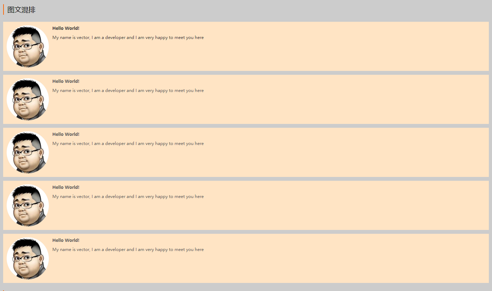

### grid网格布局使用指南

#### 网格布局父元素的属性使用

> grid-template-rows 定义网格布局的行;

- 将高度(注意:要设置height)平分三份

```
.container{
    grid-template-rows:1fr 1fr 1fr; //
}
```

- 将高度设置为固定值

```
.container{
    grid-template-rows:100px 100px 100px; //或者写为 repeate(100px)
}
```
- 给每个行起个名字

```
.container {
  grid-template-columns: [first] 40px [line2] 50px [line3] auto [col4-start] 50px [five] 40px [end];
  grid-template-rows: [row1-start] 25% [row1-end] 100px [third-line] auto [last-line];
}
```


> grid-tempe-columns 定义网格布局的列

用法可以参考grid-template-rows

> grid-gap 复合属性,定义网格布局中行列之间的间隔大小。

.container{
    grid-gap:10px 10px; // [行间隔 列间隔]
}

> justify-items 定义网格布局中的子元素的水平布局,可取值 [start | end | center | stretch]

> align-items 定义网格布局中的子元素的垂直方向的布局,可取值 [start | end | center | stretch]

